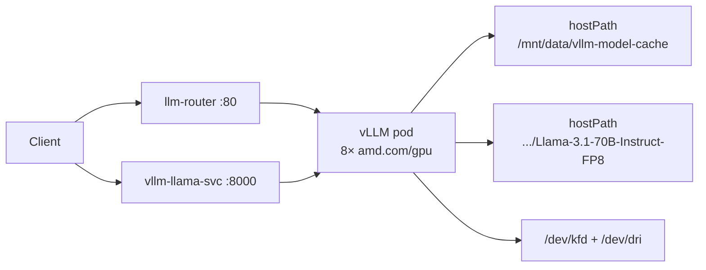

# Llama 3.1 70B Instruct FP8 — real-time vLLM on AMD GPU

Part of the [end-to-end workload overview](../README.md) — **step 2 of 3**.

Deploy `meta-llama/Llama-3.1-70B-Instruct-FP8` with vLLM on a Kubernetes cluster with AMD GPUs (MI300X / MI350X), using a hostPath model cache and optional lmstack-router for load balancing.

## Overview

| Component | Description |
|-----------|-------------|
| Model | `meta-llama/Llama-3.1-70B-Instruct-FP8` |
| vLLM image | `vllm/vllm-openai-rocm:v0.16.0` |
| GPUs | 8× AMD GPU (`amd.com/gpu: 8`, tensor parallel size 8) |
| Model cache | `/mnt/data/vllm-model-cache/meta-llama/Llama-3.1-70B-Instruct-FP8` on the GPU node |
| Namespace | `vllm` |
| Direct service | `vllm-llama-svc:8000` |
| Router service | `llm-router:80` (optional, round-robin across vLLM pods) |

## Prerequisites

### Cluster

- Kubernetes cluster with **AMD GPU device plugin** exposing `amd.com/gpu` resources
- At least one node with **8 AMD GPUs** (MI300X or MI350X class)
- GPU nodes tainted with `amd.com/gpu` (the deployment tolerates this taint)
- `kubectl` configured for the target cluster

Verify GPU availability:

```bash
kubectl get nodes -l amd.com/gpu.present=true
kubectl describe node <gpu-node-name> | grep -A5 "Allocatable"
```

### Model weights on the GPU node

This setup is for a **single bare-metal node with 8 AMD GPUs**. Download the model to the **host path on that node** before deploying vLLM. The pod mounts weights via `hostPath`; they are not fetched at runtime (`HF_HUB_OFFLINE=1`). If you use `nodeSelector` to pin the deployment, run the download on that same node.

See [step 1 — Model download](../01-vllm-model-download/README.md#download-llama-31-70b-instruct-fp8) or run on the target node:

```bash
pip install "huggingface_hub[cli]" hf_transfer
export HF_TOKEN="hf_xxxxxxxxxxxxxxxxxxxxxxxx"
export HF_HUB_ENABLE_HF_TRANSFER=1

sudo mkdir -p /mnt/data/vllm-model-cache/meta-llama/Llama-3.1-70B-Instruct-FP8

hf download meta-llama/Llama-3.1-70B-Instruct-FP8 \
  --local-dir /mnt/data/vllm-model-cache/meta-llama/Llama-3.1-70B-Instruct-FP8 \
  --token "$HF_TOKEN"

test -f /mnt/data/vllm-model-cache/meta-llama/Llama-3.1-70B-Instruct-FP8/config.json && echo "OK"
```

You must also [accept the Llama license](https://huggingface.co/meta-llama/Llama-3.1-70B-Instruct-FP8) on Hugging Face before downloading.

### Hugging Face token secret

Create the secret (required by the deployment even in offline mode):

```bash
kubectl create secret generic hf-token -n vllm \
  --from-literal=HF_TOKEN=hf_xxxxxxxxxxxxxxxxxxxxxxxx \
  --dry-run=client -o yaml | kubectl apply -f -
```

Or edit `02-secret.yaml` and apply it.

## Manifests

| File | Resource |
|------|----------|
| `01-namespace.yaml` | Namespace `vllm` |
| `02-secret.yaml` | Hugging Face token (`hf-token`) |
| `03-configmap.yaml` | vLLM runtime config + Llama 3.1 chat template |
| `04-service.yaml` | ClusterIP service for vLLM (`vllm-llama-svc:8000`) |
| `05-deployment.yaml` | vLLM Deployment (ROCm, TP=8, hostPath model mount) |
| `06-lmstack-router.yaml` | Optional lmstack-router + RBAC + service |

## Deploy

### 1. Customize for your cluster

Edit `05-deployment.yaml` before applying:

```yaml
nodeSelector:
  kubernetes.io/hostname: mi350x-4   # change to your 8-GPU AMD node name
```

Optionally tune batching and memory in `03-configmap.yaml` (`MAX_NUM_SEQS`, `MAX_MODEL_LEN`, `GPU_MEMORY_UTILIZATION`).

### 2. Apply manifests

From this directory:

```bash
kubectl apply -f 01-namespace.yaml
kubectl apply -f 02-secret.yaml      # or create secret manually (see above)
kubectl apply -f 03-configmap.yaml
kubectl apply -f 04-service.yaml
kubectl apply -f 05-deployment.yaml
```

Optional — add the router for multi-replica or pod-IP discovery routing:

```bash
kubectl apply -f 06-lmstack-router.yaml
```

Or apply everything at once:

```bash
kubectl apply -f .
```

### 3. Wait for the pod to become ready

Model load on 8 GPUs can take several minutes:

```bash
kubectl -n vllm get pods -w
kubectl -n vllm logs -f deploy/vllm-llama-fp8
```

Startup probe allows up to ~20 minutes (`failureThreshold: 40`, `periodSeconds: 30`).

### 4. Verify the endpoint

Port-forward to the vLLM service:

```bash
kubectl -n vllm port-forward svc/vllm-llama-svc 8000:8000
```

Check health and list models:

```bash
curl -s http://localhost:8000/health
curl -s http://localhost:8000/v1/models | jq .
```

Send a chat completion:

```bash
curl -s http://localhost:8000/v1/chat/completions \
  -H "Content-Type: application/json" \
  -d '{
    "model": "/models/Llama-3.1-70B-Instruct-FP8",
    "messages": [{"role": "user", "content": "Hello!"}],
    "max_tokens": 64
  }' | jq .
```

### 5. Verify via lmstack-router (optional)

If you deployed `06-lmstack-router.yaml`:

```bash
kubectl -n vllm port-forward svc/llm-router 8080:80
curl -s http://localhost:8080/health
curl -s http://localhost:8080/v1/models | jq .
```

The router discovers pods with label `app=vllm-llama` in namespace `vllm` and routes requests round-robin.

## Load benchmark

Offline throughput and power benchmark (runs on the GPU node, targets lmstack-router). See [step 3 — Load benchmark](../03-vllm-load/README.md).

Quick start — look up router ClusterIP and run from the step 3 folder:

```bash
export VLLM_URL="http://$(kubectl -n vllm get svc llm-router -o jsonpath='{.spec.clusterIP}')/v1/completions"
python3 offline_bench_4.py
```

## Architecture



## AMD / ROCm notes

- Uses the **ROCm-specific** image `vllm/vllm-openai-rocm`, not the CUDA `vllm-openai` image.
- `--enforce-eager` is **required** on ROCm; HIP graph capture is not stable on MI300X.
- `RCCL_ENABLE_XGMI=1` enables XGMI links for tensor-parallel communication across GPUs on the same node.
- `VLLM_ROCM_USE_AITER=1` enables AITER optimized kernels for MI300X.
- Device nodes `/dev/kfd` and `/dev/dri` are mounted for ROCm GPU access.
- Shared memory (`/dev/shm`, 32 Gi) is sized for RCCL with TP=8.

## Troubleshooting

| Symptom | Likely cause | Fix |
|---------|--------------|-----|
| Pod stuck `Pending` | No node with 8 free `amd.com/gpu` or wrong `nodeSelector` | `kubectl describe pod -n vllm`; fix node name or free GPUs |
| `CrashLoopBackOff` / ROCm errors | Missing `/dev/kfd` or `/dev/dri` | Confirm GPU operator/device plugin on node |
| Startup probe failures | Model not on hostPath | Download weights to `/mnt/data/vllm-model-cache/meta-llama/Llama-3.1-70B-Instruct-FP8` on the **scheduled node** |
| `config.json` not found | Wrong hostPath or model dir empty | SSH to node and verify path |
| Router returns no backends | vLLM pod not ready or wrong labels | Check `app=vllm-llama` label and `/health` on vLLM pod |
| OOM during inference | `MAX_MODEL_LEN` or `MAX_NUM_SEQS` too high | Lower values in `03-configmap.yaml` and redeploy |

## Teardown

```bash
kubectl delete -f . --ignore-not-found
```

This removes all resources in namespace `vllm` created by these manifests. Model files on the node hostPath are **not** deleted.

## Other steps

- **Step 1 — Model download**: [guide](../01-vllm-model-download/README.md)
- **Step 3 — Load benchmark**: [guide](../03-vllm-load/README.md)
