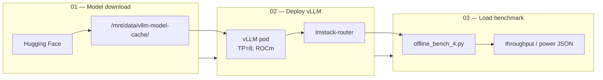
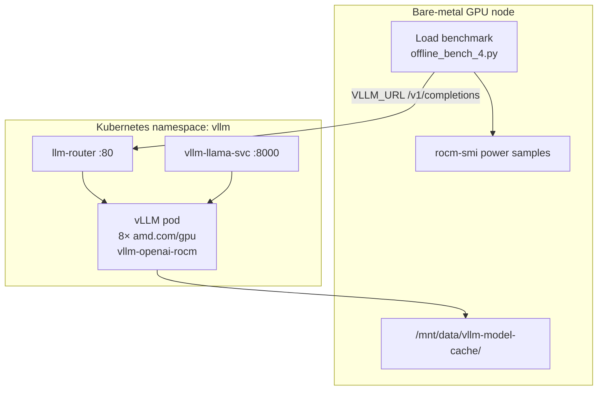

# Llama 3.1 70B Instruct FP8 — end-to-end workload

End-to-end workflow for running `meta-llama/Llama-3.1-70B-Instruct-FP8` on a **single bare-metal Kubernetes node with 8 AMD GPUs** (MI300X / MI350X): download weights, deploy vLLM with ROCm, then run an offline throughput and power benchmark.

## Workflow



| Step | Guide | What it does |
|------|-------|--------------|
| **01** | [Model download](01-vllm-model-download/README.md) | Download model weights from Hugging Face to the GPU node's host path |
| **02** | [Deploy vLLM](02-vllm-llama3-70b-fp8/README.md) | Deploy vLLM (ROCm, tensor parallel 8) and optional lmstack-router on Kubernetes |
| **03** | [Load benchmark](03-vllm-load/README.md) | Run report-grade offline benchmark against the router; collect throughput and `rocm-smi` power metrics |

Run the steps **in order**. Step 02 expects weights from step 01 on the node selected by `nodeSelector`. Step 03 expects a healthy deployment and router from step 02.

## Prerequisites

- **Single bare-metal node with 8 AMD GPUs** and `amd.com/gpu` device plugin
- Kubernetes cluster with GPU node taint tolerated (`amd.com/gpu`)
- ~100 GB free disk on the GPU node at `/mnt/data/vllm-model-cache/`
- Hugging Face account with [Llama 3.1 license accepted](https://huggingface.co/meta-llama/Llama-3.1-70B-Instruct-FP8) and a read token
- `kubectl` configured for the target cluster
- **Prometheus (or compatible scraper) configured** to collect AMD GPU and vLLM metrics during the benchmark. Use [`prometheus.yaml`](prometheus.yaml) as a starting point — it includes scrape jobs for the AMD device metrics exporter and vLLM pods:

  | Job | Target | Purpose |
  |-----|--------|---------|
  | `pebble-flex-amd-dme` | Endpoints matching `*metrics-exporter*` | AMD GPU power, temperature, and utilization from the device metrics exporter |
  | `vllm-metrics` | Pods matching `*vllm*` | vLLM inference metrics (`vllm:*`, request latency, token throughput) |

  Minimal sample of the scrape configs (see the full file for relabeling and cluster labels):

  ```yaml
  scrape_configs:
    - job_name: "pebble-flex-amd-dme"
      metrics_path: /metrics
      kubernetes_sd_configs:
        - role: endpoints
      relabel_configs:
        - source_labels: [__meta_kubernetes_service_name]
          regex: ".*metrics-exporter.*"
          action: keep

    - job_name: "vllm-metrics"
      metrics_path: /metrics
      kubernetes_sd_configs:
        - role: pod
      relabel_configs:
        - source_labels: [__meta_kubernetes_pod_label_app, __meta_kubernetes_pod_label_app_kubernetes_io_name, __meta_kubernetes_pod_name]
          regex: ".*vllm.*"
          action: keep
  ```

  Substitute `${REMOTE_WRITE_URL}`, `${REMOTE_WRITE_USERNAME}`, `${REMOTE_WRITE_PASSWORD}`, and cluster label placeholders before deploying if you use remote write. The vLLM deployment in step 2 already exposes `/metrics` on port 8000 via Prometheus annotations.

## Quick start

### Step 1 — Download model weights

On the **GPU node** that will run vLLM:

```bash
# See the step 1 guide for full details
pip install "huggingface_hub[cli]" hf_transfer
export HF_TOKEN="hf_xxxxxxxxxxxxxxxxxxxxxxxx"
export HF_HUB_ENABLE_HF_TRANSFER=1

sudo mkdir -p /mnt/data/vllm-model-cache/meta-llama/Llama-3.1-70B-Instruct-FP8

hf download meta-llama/Llama-3.1-70B-Instruct-FP8 \
  --local-dir /mnt/data/vllm-model-cache/meta-llama/Llama-3.1-70B-Instruct-FP8 \
  --token "$HF_TOKEN"
```

→ Full guide: [Step 1 — Model download](01-vllm-model-download/README.md)

### Step 2 — Deploy vLLM on Kubernetes

From a machine with `kubectl` access, open the step 2 guide and apply the manifests from that folder:

```bash
# Edit 05-deployment.yaml: set nodeSelector to your 8-GPU node
# Create hf-token secret (see step 2 README)

kubectl apply -f .
kubectl -n vllm get pods -w
```

Deploy lmstack-router if not included in your apply set:

```bash
kubectl apply -f 06-lmstack-router.yaml
```

→ Full guide: [Step 2 — Deploy vLLM](02-vllm-llama3-70b-fp8/README.md)

### Step 3 — Run load benchmark

On the **GPU node** (needs `rocm-smi`), open the step 3 guide and run from that folder:

```bash
pip install aiohttp datasets   # datasets only needed to generate prompts.json
python3 download_prompts.py    # if prompts.json not present (requires HF_TOKEN)

export VLLM_URL="http://$(kubectl -n vllm get svc llm-router -o jsonpath='{.spec.clusterIP}')/v1/completions"
python3 offline_bench_4.py
```

→ Full guide: [Step 3 — Load benchmark](03-vllm-load/README.md)

## Step reference

### Step 1 — Model download

| | |
|---|---|
| **Purpose** | Download and cache Hugging Face model weights on the GPU node |
| **Run where** | Bare-metal GPU node (SSH) |
| **Key output** | `/mnt/data/vllm-model-cache/meta-llama/Llama-3.1-70B-Instruct-FP8/` |
| **Contents** | `README.md` — HF CLI and Python download instructions |

### Step 2 — Deploy vLLM

| | |
|---|---|
| **Purpose** | Real-time vLLM inference on 8× AMD GPU via Kubernetes |
| **Run where** | Any host with `kubectl` |
| **Key outputs** | `vllm-llama-svc:8000`, `llm-router:80` in namespace `vllm` |
| **Contents** | Numbered Kubernetes manifests (`01-namespace.yaml` … `06-lmstack-router.yaml`) |

| Manifest | Resource |
|----------|----------|
| `01-namespace.yaml` | Namespace `vllm` |
| `02-secret.yaml` | Hugging Face token |
| `03-configmap.yaml` | vLLM config + Llama 3.1 chat template |
| `04-service.yaml` | vLLM ClusterIP service |
| `05-deployment.yaml` | vLLM Deployment (ROCm, TP=8, hostPath) |
| `06-lmstack-router.yaml` | lmstack-router + RBAC |

### Step 3 — Load benchmark

| | |
|---|---|
| **Purpose** | Offline throughput and power benchmark with warmup exclusion and trial statistics |
| **Run where** | Bare-metal GPU node (same node as inference) |
| **Key output** | `${LABEL}_<timestamp>_summary.json` |
| **Contents** | `offline_bench_4.py`, `download_prompts.py`, `README.md` |

Default benchmark settings: 600 s duration, 60 s warmup, 512 concurrent requests, 1024 max tokens, 3 trials. Targets lmstack-router at `/v1/completions`.

## Architecture



## Teardown

Remove Kubernetes resources from step 2 (model files on disk are preserved):

```bash
kubectl delete -f . --ignore-not-found
```

Run the command above from the folder containing the step 2 Kubernetes manifests.
